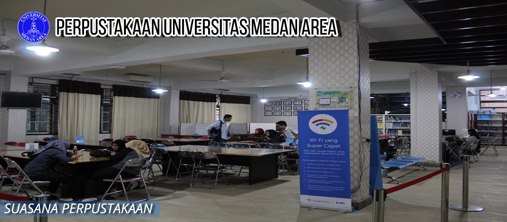
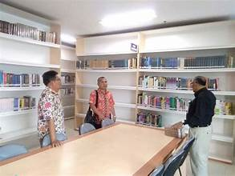

# sillaslibrary
<!DOCTYPE html> 
<html>
<head>
	<title> Profil Perpustakaan UMA</title>
</head>
</body>

<b><head><tittle>Tugas Modul 1(1) Pemograman Web Praktik</tittle></head></b>

<body>

Nama: Aulika Dwi Priscilla

Nim: 210709023

 
 

Profil Perpustakaan UMA:

<b>1. Perpustakaan UMA</b>

<a href="https://perpustakaan.uma.ac.id/">
    &emsp;

&emsp;Perpustakaan Universitas Medan Area memilik 2 Pusat Perpustakaan dan 8 Perpustakaan cabang. Perpustakaan pusat 1 berlokasi di sebelah barat mesjid taqwa UMA. Perpustakaan Pusat yang kedua berlokasi di Jl. Setia Budi No.79B, Tj. Rejo, Medan, begitupun Perpustakaan Pascasarjana berada di alamat 
    yang dimaksud, lokasinya dipusat gedung perkuliahan mahasiswa program master dan doktor. Sementara perpustakaan cabang berada disetiap fakultas, diantaranya : Teknik, Pertanian, Ekonomi dan Bisnis, Hukum, Ilmu Sosial dan Ilmu Politik, Psikologi dan Biologi. Selain itu, Perpustakaan Pusat Islam yang berada didalam mesjid UMA. Secara keseluruhan koleksi Universitas Medan Area sebanyak 17.490 judul, dan 36.944 eksemplar terdiri dari buku teks, e-book, jurnal, undang-undang, fiksi, kamus, koleksi kuno, al-quran, bulletin, buku panduan, atlas, buku ajar, almanac, referensi electronic resource, e-magazine, e-prociding dan cd-rom.

    </a>

Profil Perpustakaan UMSU:

<b>2. Perpustakaan UMSU</b>

<a href="https://perpustakaan.umsu.ac.id/">
    &emsp;

&emsp;Atas bantuan dari H. Probo Sutedjo selaku dewan kurator UMSU Medan, berdirilah kampus III yang terletak di Jalan Kapten Muchtar Basri, BA No. 3 (Kampus Mercubuana) dengan luas bangunan ± 2 hektar. Pada tahun 1992 kampus III UMSU diresmikan pemakaiannya oleh Menteri Penerangan Harmoko yang sekaligus meresmikan tiga unit gedung yaitu gedung Rektorat, gedung Fakultas Ekonomi dan gedung Fakultas Hukum yang tergabung dengan Fakultas Isipol serta Rektorat UMSU Medan yang semula berada pada kampus I pindah ke kampus III.
    Perpustakaan UMSU mulanya telah berdiri di lingkungan kampus I sejak tahun 1957 tepatnya pada tanggal 17 Februari bersamaan dengan berdirinya Fakultas Filsafat. Sebagaimana yang telah diuraikan di atas, oleh karena meningkatnya jumlah manusia yang mendaftar ke UMSU Medan dimulai pada tahun 1982, pusat penyelenggaraan akademik UMSU Medan yang sebelumnya berada pada kampus I pindah ke kampus III termasuk gedung Rektorat UMSU Medan.

    <section>

<audio controls width="300" height="200">
<source src="Abdul & The Coffee Theory - Happy Ending.mp3">
</audio>

        <video controls width="300" height="200">
            <source src="video_UMSU.mp4" type="video/mp4">
        </video>

        <head>
	<title> Formulir Perpanjangan Buku </title>
</head>
</body>
<h2 align="center">  Form Perpanjangan Masa Pinjam </h2>
	
 Pengajuan Perpanjangan Masa Pinjam Buku secara online hanya akan dilayani apabila dilakukan pada hari dan jam kerja (Senin s.d Jumat pukul 08.00-15.30), peminjaman belum melebihi tenggat waktu pengembalian, serta hanya dapat dilakukan satu kali di setiap peminjaman untuk buku yang sama. 

	
	 <form action="contact.php" method="POST">
        <fieldset>
        

            <label> Member ID :</label>
            <input type="text" name="name"/>
        

		

            <label> Kode Eksemplar :</label>
            <input type="text" name="name"/>
        

		

            <input type="submit" name="submit" value="Submit" />
        

		 </fieldset>
</body>

<h2 align="center"> Formulir keanggotan perpustakaan</h2>
<table border="1" >

	<title> Form Anggota Perpustakaan </title>

<th colspan="2"> Formulir Anggota Perpustakaan Program Studi Perpustakaan dan Sains Informasi </th>

	<tr>
		<td> NAMA			
		  NIM 			
		  ALAMAT			
		  JENIS KELAMIN 	
		  EMAIL 			
		  NO.HP 			
		  TEMPAT LAHIR 	
		  TANGGAL LAHIR 	</td>
		
		<td> Aulika Dwi Priscilla
		  210709023
		  Jalan Delitua GG Tanjung NO 14
		  Perempuan
		  aulikadpriscilla0128@gmail.com
		  089518205415
		  Suka Makmur
		  28 Januari 2003
		</td>
		
</tr>5
		
</table>

	<head>
		<h2 align="center"> Form Pemesanan buku</h2>
	</form action="contatct.php" method="POST">
	<fieldset>
	<legend> </legend>
	

		<label> Nama Customer : </label>
		<input type="text" name="name"/>
	

	

		<label> Tanggal Pemesanan : </label>
		<input type="date" name="tanggal"/>
	

	

		<label> Alamat : </legend>
		<input type="text" name="name"/>
	

	

		<label> Judul Buku : </label>
		<input type="text" name="name"/>
	

	

		<label> Pengarang : </label>
		<input type="text" name="name"/>
	

	

		<label> Jumlah Buku : </label>
		<input type="text" name="name"/>
	

	

	
		<input type ="submit" name="submit" value="Send"/>
	

	</fieldset>
</form>

</head>

</body>
</body>

<h2 align="center">Tabel koleksi Buku</h2>
<table border="1">
    <tr>
        <td style="text-align:center"> <b> Judul </b> </td>
        <td style="text-align:center"> <b> No. Akses </b> </td>
        <td style="text-align:center"> <b> No. Panggil </b> </td>
        <td style="text-align:center"> <b> Pengarang </b> </td>
        <td style="text-align:center"> <b> Subjek </b> </td>
        <td style="text-align:center"> <b> Nama Penerbit </b> </td>
        <td style="text-align:center"> <b> Tahun Terbit </b> </td> 
    </tr>

    <tr>
        <td> Concepts Of Modern Physics 6th.Ed </td>
        <td> EB18001941 </td>
        <td> 530 Art c </td>
        <td> Arthur Beiser </td>
        <td> Fisika </td>
        <td> Kent A. Peterson </td>
        <td> 2003 </td>
    </tr>
    
        <td> Molecular Plant-Microbe Interactions </td>
        <td> EB18000818 </td>
        <td> 581.6 Kam m f</td>
        <td> Kamal Bouarab</td>
        <td> Tanaman, Nontaksonomik</td>
        <td> Cabi Publishing </td>
        <td> 2009 </td>
	</tr>
		<td> Math In Focus </td>
        <td> EB18001899 </td>
        <td> 320 Cav m </td>
        <td> Marshall Cavendish </td>
        <td> Matematika </td>
        <td> Marshall Cavendish International </td>
        <td> 2012</td>
    </tr>
    </table>

    <head>
		<title>HTML dan CSS</title>
	<body>
		<h1 style="color:rgba(230, 17, 230, 0.904)">HTML dan CSS</h1>
		<h2 style="color:plum">Pengertian HTML</h2>
			
HTML atau Hypertext Markup Language adalah bahasa markup yang digunakan untuk membuat struktur halaman website agar dapat ditampilkan pada web browser. Jadi, HTML dapat dianalogikan sebagai pondasi awal dalam menyusun kerangka halaman web secara terstruktur sebelum membahas terkait tampilan desain dan sisi fungsionalitas.

			<h2 style="color:plum">Fungsi HTML</h2>	
			
Secara umum, fungsi HTML adalah untuk mengelola serangkaian data dan informasi sehingga suatu dokumen dapat diakses dan ditampilkan di Internet melalui layanan web. Fungsi HTML yang lebih spesifik yaitu : Membuat halaman web. Menampilkan berbagai informasi di dalam sebuah browser Internet.

			<h2 style="color:plum">Kelebihan HTML</h2>
			<ul>
				<li> Bisa digunakan jenis komputer berbeda</li>
				<li> Bisa disisipkan gambar</li>
				<li> Bisa disisipkan gambar</li>
				<li> Bisa disisipkan animasi</li>
				<li> Bisa disisipkan bahasa pemrograman</li>
				<li> Tidak memerlukan kompiler</li>
			</ul>
			<h2 style="color:plum">Kekurangan HTML</h2>
			<ul>
				<li> Menghasilkan halaman statis </li>
				<li> Mempunyai tag yang sangat banyak </li>
				<li> Tidak bisa menghasilkan halaman interaktif</li>
			</ul>
		
		<h2 style="color:rgb(236, 163, 175)">Pengertian CSS</h2>
			
Cascading Style Sheets (CSS) merupakan bahasa pemrograman yang digunakan untuk menentukan bagaimana dokumen dan website akan disajikan. CSS dibuat oleh Word Wide Web Consortium (W3C) pada 1996.

		<h2 style="color:rgb(236, 163, 175)">Jenis Jenis CSS</h2>
			<ul>
				<li> Inline Style CSS merupakan kode yang dituliskan di dalam file HTML dan menggunakan elemen spesifik yang memuat tag style</li>
				<li> Internal CSS merupakan kode yang dituliskan pada bagian header file HTML. Sayangnya, jenis ini terkadang membuat loading menjadi semakin lama</li>
				<li> External CSS merupakan kode CSS yang diletakkan di luar dokumen HTML sebagai file .css. External CSS memiliki fungsi untuk mengkustomisasi semua tampilan halaman website yang sudah ditentukan atau beberapa halaman sekaligus</li>
			</ul>
		<h2 style="color:rgb(236, 163, 175)">Fungsi CSS</h2>
			<ul>
				<li> Proses loading halaman web lebih cepat</li>
				<li> Tampilan website akan lebih rapi</li>
				<li> Beragam Variasi</li>
			</ul>
	</body>
</html>
<head>
	
</head>
</html>
